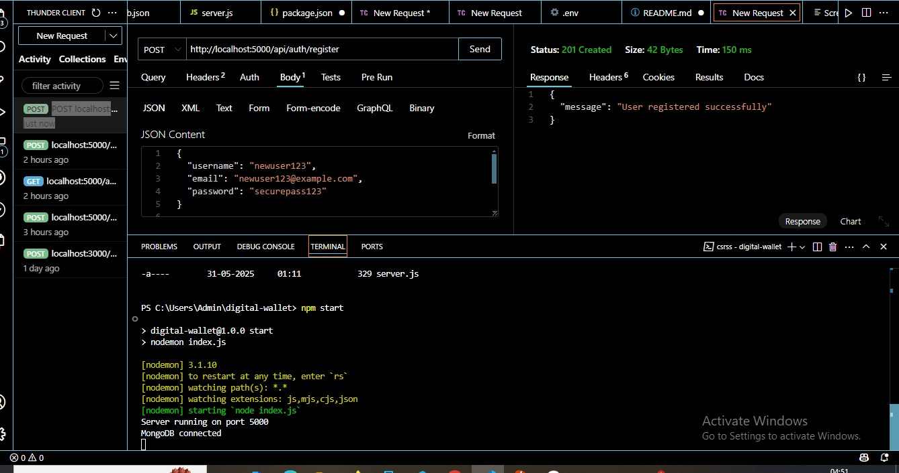
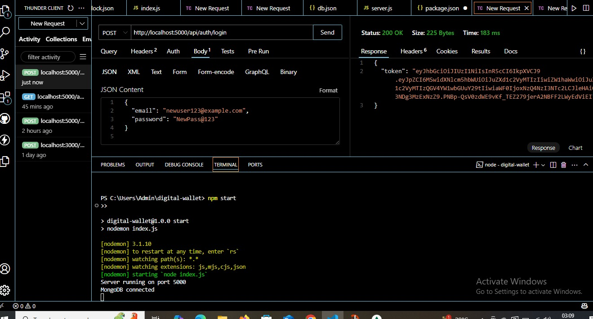
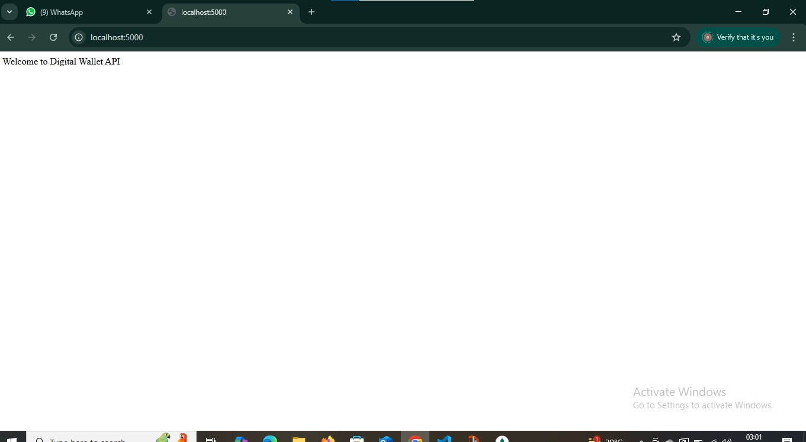

**Digital Wallet System Backend - README**
Overview & Features

 **Overview**

This project is a backend implementation of a Digital Wallet System. It allows users to register, log in, and
securely manage their virtual wallets by depositing, withdrawing, and transferring funds. Alongside core wallet
functionality, the system includes basic fraud detection to catch suspicious activity, and admin features to
monitor flagged transactions and user statistics.

**Features**

User Authentication & Security:-
- User registration with password hashing (bcrypt) for secure storage.
- Login system that issues JWT tokens to authenticate users.
- Middleware to protect wallet and transaction routes, ensuring only authorized access.
- Tokens include expiration for better security.
Wallet Management:-
- Users can deposit and withdraw virtual currency.
- Ability to transfer funds to other users, with validation to prevent overdrafts or invalid transactions.
- Transaction history stored and accessible per user.
Fraud Detection:-
- Flags when more than three transfers are made within one minute from the same user.
- Flags large withdrawals exceeding Rs.50,000.
- Flagged transactions are stored separately to aid admin review.
Admin Tools:-
- Endpoints to view flagged suspicious transactions.
- Summary reports on total user balances.
- List of top users by wallet balance or transaction activity.
Bonus Features:-
- Chat-Based Transaction Assistant: Parses natural language instructions like "Send Rs.1000 to Aman" and
executes transfers.
Transaction Cool-Down: Enforces a 30-second wait between transfers to prevent rapid-fire transactions.
- Disposable Wallets: Wallets that freeze after a single use for temporary or one-time transactions.

**Tech Stack**

- Node.js with Express framework for backend server.
- MongoDB for database, accessed through Mongoose ODM.
- bcrypt for password hashing.
- jsonwebtoken (JWT) for user session management.
- dotenv to handle environment variables.
- nodemon for live server reload during development.
- Postman used for API testing and documentation.
                                        
**Project Structure**

digital-wallet/
- config/: Database connection setup
- controllers/: Core business logic for users, wallets, transactions
- middleware/: Authentication, fraud detection, other middleware
- models/: Mongoose schemas: User, Wallet, Transaction
- routes/: API endpoints
- utils/: Helper functions (chat parsing, fraud rules)
- index.js: Application entry point
- .env: Environment variables (JWT secret, DB URI)
- package.json: Dependencies and scripts
- README.md: This documentation

 **Getting Started**

Prerequisites
Make sure you have Node.js and npm installed. Also, a running MongoDB instance or MongoDB Atlas
connection URI.
Installation
1. Clone the repository:

 2. Install dependencies:
 npm install
3. Setup environment variables:
 Create a .env file in the root with:
 MONGO_URI=your_mongodb_connection_string
 JWT_SECRET=your_secret_key
 PORT=5000
4. Run the server:
 For development with auto reload:
 npm run start
5. server will be live at http://localhost:5000.

                                                **API Overview**

Authentication
- POST /api/auth/register: Register new users with username, email, and password.
- POST /api/auth/login: Login and receive JWT token for authenticated requests.
Wallet & Transactions
- POST /api/wallet/deposit: Deposit virtual currency (authentication required).
- POST /api/wallet/withdraw: Withdraw funds (authentication required).
- POST /api/wallet/transfer: Transfer funds to other users (authentication required).
- GET /api/transactions: Retrieve transaction history (authentication required).
Admin Endpoints
- GET /api/admin/flagged: Get list of flagged suspicious transactions.
- GET /api/admin/total-balances: Get aggregated wallet balances.
- GET /api/admin/top-users: List top users by wallet balance or transaction count.
Bonus Feature
- POST /api/assistant: Chat-based assistant to parse commands and execute transactions.
Testing
Use Postman to test APIs. Import the provided Postman collection for ready-to-use requests.
Remember to register new users with unique emails before logging in.
Use the JWT token from login in the Authorization header (Bearer <token>) for protected routes.

**Screenshots**

1. User registration successful response.

2. User login with JWT token received.

3. homepage/dashboard

                                             **Future Improvements**

- Add refresh tokens for better session management.
- Integrate real email alerts for suspicious transactions.
- Enhance fraud detection with machine learning techniques.
- Implement soft delete functionality for users and transactions.
- Build a frontend client for a complete user experience.

**Contact**

If you have questions or suggestions, please open an issue or contact me at Anjanapassi1510@gmail.com , anjana011btit23@igdtuw.ac.in.
Thank you for checking out this Digital Wallet backend project. I hope it provides a solid foundation for
building secure and reliable wallet-based applications.